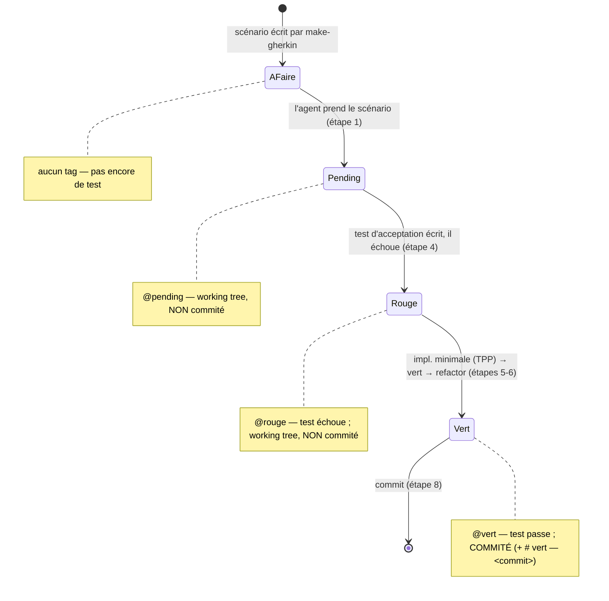

# TDD Implement

## Vue d'ensemble

Implémenter un fichier de scénarios `make-gherkin` en **BDD + TDD**, **un scénario
à la fois**. C'est la 3ᵉ pipeline : entrée = `docs/sprints/<sujet>.md`,
sortie = du code testé, commité scénario par scénario.

**Backend d'abord, IHM en fin — sauf scénario IHM.** Les scénarios **backend** couvrent
le domaine + use cases + ports doublés, l'acceptation s'arrêtant à la frontière de
l'Application. L'**IHM Blazor restante** (écrans sans scénario dédié) est construite en
**une phase finale**, une fois les scénarios backend verts (cf. « Phase IHM finale »).
**Un scénario dont le comportement/défaut vit dans le `.razor`** (interactivité,
`@onclick`, `@bind`, render mode, DI réelle, SignalR) est un **scénario IHM** : il est
routé vers `ihm-builder` et **piloté par un test d'acceptation de niveau runtime** (cf.
« Niveau de test = niveau du symptôme »), pas planifié comme un test backend à doublures.

> **Niveau de test = niveau du symptôme (règle cardinale).** Le **niveau du test
> d'acceptation doit correspondre au niveau du symptôme** :
> - **domaine pur** → test **unitaire** ;
> - **orchestration Application** → test **handler / intégration** ;
> - **comportement IHM / interactivité / runtime** → test **E2E / runtime** sur l'app
>   réellement câblée (DI réelle ; ex. Playwright ou `WebApplicationFactory` sur l'hôte
>   réel), **JAMAIS bUnit seul** comme preuve d'acceptation d'un bug runtime.
>
> Pour un bug d'**usage/runtime**, un **test bUnit composant avec doublures est
> INSUFFISANT** : bUnit **rend toujours** le composant interactif et câble des doublures,
> donc il **ne peut PAS** attraper un **render mode manquant** (ni une DI/SignalR réelle
> absente) et **« ment au vert »** alors que l'app réelle échoue. Le rouge doit échouer
> **comme l'utilisateur le voit**.
>
> **Garde-fou concret.** Un **render mode Blazor manquant** (`@rendermode
> InteractiveServer` absent de `App.razor` / des pages) rend l'app **statique** :
> `@onclick` et `@bind` sont **morts**. **bUnit ne l'attrape jamais.**

**Principe central — la double boucle :**
- **Boucle externe (BDD)** : chaque `Scenario N` Gherkin devient un **test
  d'acceptation exécutable** (Given/When/Then mappés 1:1). Il échoue d'abord, et
  ne passe au vert que quand le comportement observable est livré.
- **Boucle interne (TDD)** : pour faire passer l'acceptation, on écrit des tests
  unitaires rouges puis l'implémentation minimale (YAGNI) qui les rend verts.

Cible technique : `.NET` backend, `Blazor` + `SignalR` front, tests `xUnit`
(backend), `bUnit` (composants Blazor), test d'intégration pour le temps réel.

## Discipline DDD / Clean Archi

La discipline TDD (rouge/vert, FLFI, TPP, sociable) ne suffit pas : ces règles
décident **où vit le comportement** et **comment on l'observe**. Elles priment sur
toute facilité d'implémentation.

- **La règle métier vit dans l'agrégat, pas dans le handler.** Une décision
  (validation d'invariant, dérivation d'état) se code dans la racine d'agrégat /
  l'entité (`planning.AffecterGarde(...)`), jamais dans le use case. Le handler
  **orchestre** : charge l'agrégat, lui délègue la décision (*Tell, Don't Ask*),
  sauvegarde. Un `if` métier ou un getter « juste pour décider » dans le handler =
  fuite → repousse la règle dans le domaine.
- **Règle de dépendance — le domaine ne dépend de rien.** Zéro framework dans le
  cœur : pas d'attribut EF (`[Table]`, `[Key]`), pas de navigation ORM, pas de
  `DbContext`, pas d'ASP.NET/SignalR dans Domain ni Application. La persistance vit
  dans l'adaptateur secondaire (POCO Rows + Fluent API). Litmus : testable sans
  framework ? infra remplaçable sans toucher au domaine ?
- **Pattern Snapshot — point d'observation de l'état.** Si l'agrégat n'expose aucun
  getter, asserte via son **snapshot** (`planning.ToSnapshot().Gardes.Should()…`),
  jamais sur l'entité (`Should().Be(...)` sur un agrégat ne compare souvent que
  l'identité → faux vert). N'ajoute **jamais** un getter public « juste pour le
  test ». Persister un agrégat passe par `ToSnapshot`/`FromSnapshot`, pas par un
  mapping ORM direct sur l'entité.
- **Fixtures via builders / `FromSnapshot`.** Pose l'état d'un agrégat (libre, déjà
  affecté, plafond atteint) par un builder ou `FromSnapshot`, **jamais** par le
  mutateur métier (`AffecterGarde`) : utiliser l'action testée pour le setup couple le
  test à sa logique et empêche de poser un état que le mutateur interdit.
- **Fake repository = copy-on-read, minimal.** `Save`/`FindById` font une **copie**
  (`FromSnapshot(ToSnapshot())`) pour qu'une mutation ne fuie pas dans l'état stocké ;
  expose `AllSnapshots()` pour les assertions. N'y greffe pas de liste d'événements.
- **Événement de domaine** → assert via le mécanisme de publication du projet (outbox
  / dispatcher drainé), pas en greffant une liste sur le fake repository. N'ajoute la
  machinerie d'événements **que** si un scénario l'exige.
- **Convention de signalement d'erreur tranchée une fois.** Refus d'un use case : soit
  exception de domaine typée, soit type résultat fermé (`Result` / `Either`). Tiens la
  même sur tous les scénarios ; si l'analyse technique ne tranche pas → question de
  scaffolding (round-trip). Un `@erreur` vérifie aussi **l'absence d'effet de bord**
  (`repo.AllSnapshots().Should().BeEmpty()`).
- **Write vs read (CQRS).** Un getter de vue / une capacité « liste mes X » sur un
  agrégat = lecture qui pollue le modèle d'écriture → crée une projection (Query +
  read model), ne touche pas l'agrégat.
- **Port d'une frontière de contexte = capacité, pas mécanisme.** Nomme-le par la
  question métier (`IEligibilite.PeutPrendreGarde(...)`), pas par sa stratégie de
  réponse ; le contrat transporte un **verdict**, pas le vocabulaire de l'autre
  contexte.

## Quand l'utiliser

- Après `make-gherkin`, pour transformer les scénarios en code.
- Un scénario à la fois — pas d'implémentation en bloc.

## Processus

1. **Lis le fichier de scénarios.** Charge `docs/sprints/<sujet>.md` :
   la section `## Analyse technique` (composants, contrats, points TDD) et la
   section `## Scénarios`. Repère le **prochain scénario non implémenté** =
   **premier scénario sans tag `@vert`** (ordre de numérotation continue), ou le
   scénario demandé. **Ajoute le tag `@pending`** à côté de son tag de type
   (working tree uniquement, **non commité**) pour signaler le travail en cours —
   il redevient visible si le run est interrompu avant le vert.

   > **Deux tags indépendants.** Le tag de **type** (`@nominal` / `@limite` /
   > `@erreur`) est **permanent** : ne l'enlève jamais. Le tag de **cycle**
   > (`@pending` → `@rouge` → `@vert`) s'ajoute **à côté** et n'échange qu'entre
   > eux. Exemple : `@limite` → `@limite @pending` → `@limite @rouge` →
   > `@limite @vert`.

2. **Vérifie la solution .NET.** Si aucune solution n'existe et que rien n'a
   encore été scaffoldé → **pose la question de scaffolding** (round-trip) :
   structure des projets (backend, Blazor, tests), avant d'écrire le moindre test.
   Ne scaffolde jamais en silence une arborescence structurante.
   - **Au scaffolding, génère aussi le lanceur** : le script
     `.claude/skills/run/scripts/run.ps1` (build + démarrage de l'hôte Blazor) et le
     skill `.claude/skills/run/SKILL.md` qui l'enrobe, pour lancer l'appli d'une
     commande (`pwsh .claude/skills/run/scripts/run.ps1`). Cible le projet Web réel
     créé. (S'ils existent déjà, ne les recrée pas.)

3. **Boucle externe (BDD) — écris le test d'acceptation rouge.** *(Pour un **scénario
   backend**. Un `🖥️ scénario IHM` suit le cycle « Scénario IHM (RED→GREEN runtime) »
   et est mené par `ihm-builder` — son acceptation est un test runtime, pas le test à la
   frontière Application décrit ici.)* Traduis le scénario cible en un test exécutable
   **à la frontière de l'Application** (use case / handler), **pas** au niveau de l'IHM
   Blazor. Pendant les scénarios backend on ne construit **que le backend** (domaine +
   use cases + ports doublés) ; l'**IHM Blazor et le câblage SignalR réel sont repoussés
   à la phase finale** (cf. « Phase IHM finale ») **ou** traités via un scénario IHM
   dédié. L'observable d'un `Then` se vérifie donc via le retour du handler,
   l'état exposé du repository (fake), ou un **Spy** sur le port de notification.
   - `Given` → arrange (Fakes / Givens, état initial) via **builders / `FromSnapshot`**,
     jamais via le mutateur métier testé (cf. *Discipline DDD*).
   - `When` → act (l'action déclenchée).
   - chaque ligne `Then` observable → un `assert`.
   - Les tags `@nominal` / `@limite` / `@erreur` orientent le type d'assertion.
   - **Nommage FLFI** (*Final Label, First Implementation*) : nomme le test
     `Should_<résultat métier final>_When_<conditions complètes>`, en **langage
     métier** — pas `throws`, `returns null`, `HTTP 200`. L'étiquette est **finale
     dès le rouge** ; seule l'implémentation derrière progressera.
     - ❌ `Should_apply_surcharge`
     - ✅ `Should_apply_a_20_percent_surcharge_When_on_call_during_a_public_holiday`
   - **Doublures écrites à la main** (Fake / Stub / Spy via les Fakes/Givens du
     projet), **jamais** de framework de mock. Choix par rôle : repository/UoW →
     **Fake** mémoire (copy-on-read) ; réponse fixe (horloge, ID déterministe) →
     **Stub** ; vérification d'appels (événement publié, notification) → **Spy**.
   - **Tests sociables** : on ne double **que les ports** qui franchissent une
     frontière (repository, horloge, service externe). Les objets métier
     collaborent **pour de vrai** — ne double jamais un collaborateur interne du
     domaine. Symptôme de sur-doublage : un refactor du domaine casse le test sans
     changer le comportement → tu mockes trop.
   - **Assertion sur le comportement observable**, via la frontière publique (état
     exposé, valeur de retour, événement émis), **jamais** sur un champ privé.
   - Temps réel `SignalR` **pendant les scénarios** → doublé par un **Spy sur le port
     de notification** (`INotificateurPlanning`) au niveau use case : on vérifie que la
     notification est **émise** avec le bon contenu, pas le transport. Le **hub SignalR
     réel** et le test d'intégration « second client » sont construits en **phase IHM
     finale** (cf. section dédiée).

4. **Confirme le ROUGE.** Lance le test → il **doit** échouer.
   - **EARLY GREEN** : s'il passe d'emblée, le test n'observe rien (ou le
     comportement existe déjà) → ce n'est **pas** un vrai rouge. Ne tagge **pas**
     `@vert` : réécris l'assertion pour qu'elle observe vraiment le `Then`, ou (si
     le comportement est réellement déjà couvert) signale-le en checkpoint plutôt
     que de prétendre avoir bouclé un cycle.
   - **GREEN-PAR-ABSENCE** : avant de croire un rouge **ou** un vert, vérifie le
     **compte de tests exécutés** dans la sortie `dotnet test` (`N passed/failed`,
     pas `0 total`). Un test dans le mauvais projet, avec un `[Trait]` mal
     orthographié, ou hors du `--filter` lancé ne s'exécute **jamais silencieusement**
     — ni rouge ni vert, juste absent. Confirme que ton test apparaît nommément.
   - **Remplace le tag de cycle `@pending` par `@rouge`** (le tag de type reste)
     dans le fichier (working tree, non commité) : le test d'acceptation existe et
     échoue.

5. **Boucle interne (TDD) — du simple au complexe (TPP).** Écris l'**implémentation
   minimale** (YAGNI), en t'appuyant sur des cycles rouge/vert **au niveau du use
   case** (point d'entrée du TDD sociable). Les classes qui émergent du refactoring
   (value objects, gardes privés) **n'ont pas de test dédié** — couvertes
   transitivement ; n'isole un test que sur une vraie frontière, jamais un
   collaborateur interne du domaine. **Point de passage obligatoire :**
   ordonne ces cycles unitaires par **complexité croissante** (*Transformation
   Priority Premise*) — d'abord la constante / le cas dégénéré, puis le
   conditionnel, puis l'itération / le cas général.
   - **Heuristique de contradiction** : chaque test unitaire suivant doit rendre
     **faux** un code qui passait avant — c'est cette contradiction qui force
     l'implémentation à évoluer. Si un test ne contredit rien, c'est un doublon
     (EARLY GREEN déguisé) → supprime-le ou intercale un test plus simple.
   - **First implementation « bête » assumée** : un vert minimal qui sur-généralise
     (renvoie une constante, applique la règle à tout le monde) est légitime tant
     qu'un test suivant le contredira. N'anticipe pas ; n'écris pas le `if` ou la
     boucle avant qu'un test ne l'exige.
   - **Refus inconditionnel d'abord** : un scénario `@erreur` / une garde pris en
     premier (« refuser quand X n'existe pas ») se satisfait par une instruction
     **inconditionnelle** (`throw …;`), pas un `if` / `?? throw`. La recherche
     conditionnelle (la vraie garde) n'apparaît qu'au scénario **nominal ultérieur**
     où un X existant doit réussir et contredit le toujours-refuser. Écrire la branche
     tout de suite vole son rouge au scénario nominal.
   - **Pas de code défensif sans rouge** : aucun garde / `throw` / null-check qui
     ne soit exigé par un test qui échoue d'abord.

6. **Confirme le VERT, puis REFACTOR.** Lance le test d'acceptation **et** la
   suite complète (non-régression). Tout doit être vert.
   - **La non-régression recompile TOUS les projets.** Lance-la **sans jamais `--no-build`**
     ni filtre projet partiel : `dotnet test` (et/ou `dotnet build` de la solution) doit
     recompiler **tous** les projets de prod, pas seulement ceux des tests lancés. Un
     `--no-build` / filtre laisse un projet de prod non recompilé éventuellement cassé et fait
     **mentir le vert** (cf. Sc.1 s07 : front Web non compilable masqué par `dotnet test
     --no-build` sur Web.Tests, détecté seulement au scénario suivant).
   - **Outil (économie de tokens).** Pour la non-régression, préfère
     `pwsh -NoProfile -File .claude/skills/tdd-implement/scripts/test-count.ps1` : il lance la
     suite COMPLÈTE (build complet, défaut sûr) et ne renvoie qu'un **JSON compact**
     `{ green, total, passed, failed, assemblies }` au lieu de la sortie verbeuse de `dotnet
     test` — n'ingère pas des milliers de lignes à chaque cycle. Sur rouge il ajoute
     `failures` (plafonné). N'utilise `-Filter` que pour un **RED ciblé**, jamais comme preuve
     de non-régression.
   - **Auto-revue de minimalité avant commit.** Relis le diff : toute construction neuve
     (généralisation, branche, boucle) non forcée par un rouge de ce scénario vole le rouge
     d'un scénario futur (early-green déguisé) → retire-la, ou STOP (escalade CP) si déjà
     couverte.
   - **Le test ne bouge pas pour passer.** Tu fais évoluer l'**implémentation**
     jusqu'au vert ; tu ne modifies **jamais** l'assertion du test d'acceptation
     pour la faire correspondre au code. Test à corriger = retour à l'étape 3.
   - **Étape refactor = construction.** Une fois au vert, nettoie sous le filet des
     tests verts **sans changer le comportement** (relance la suite → toujours
     vert). Le refactor n'est pas que du ménage : il **prépare le prochain test**
     — extrais un garde, une abstraction, un value object **quand 2-3 cycles l'ont
     fait émerger** (jamais par anticipation). Refactore aussi **les tests** :
     regroupe par contexte métier (classes imbriquées), paramètre les variations
     d'un même comportement (`[Theory]`). Nuance : **même comportement, données ≠** →
     `[Theory]` ; **comportements ≠** (refus distincts) → `[Fact]` séparés.
     **Boussole DDD** : comportement avec les données (pas de modèle anémique / setter
     public), primitif récurrent porteur de règle → value object (record immuable),
     référence inter-agrégat par **`Id`** (pas par objet), collections
     `IReadOnlyList<T>`, éviter `null`. Le refactor entre dans le **même commit**
     que le scénario.

7. **Passe le scénario au vert dans le fichier de scénarios.** Édite
   `docs/sprints/<sujet>.md` : **remplace le tag de cycle `@rouge`** (posé à
   l'étape 4) par `@vert` (le tag de type reste) et ajoute une ligne
   `# vert — <commit court>` (le **hash** du commit, pas une description).
   (Détection du « prochain » à l'étape 1 = 1er sans `@vert`.) Voir le cycle de vie
   ci-dessous.

8. **Commit.** Test(s) + implémentation **+ la mise à jour `@vert` du fichier de
   scénarios**, message référant le scénario
   (ex. `feat: scénario 3 — réservation d'un créneau libre`).

9. **Checkpoint.** Rends la main avec le récap (rouge → vert → commit). Sur une
   **ambiguïté technique réelle** (choix structurant non tranché par l'analyse
   technique), pose une question (round-trip) plutôt que de deviner en silence.

## Scénario IHM (RED→GREEN piloté par un test runtime)

Quand un scénario porte sur l'**IHM** (comportement/défaut dans le `.razor` :
interactivité, `@onclick`, `@bind`, render mode, rendu, navigation, DI réelle, SignalR),
il **n'est pas** planifié comme un test backend à doublures et **n'attend pas** la phase
finale. `tdd-analyse` l'**étiquette `🖥️ scénario IHM`** et le route vers `ihm-builder`,
qui le mène en **vrai cycle RED→GREEN** :

1. **Rouge runtime** — un test d'acceptation de **niveau runtime** sur l'**app réellement
   câblée** (DI réelle ; Playwright ou `WebApplicationFactory` sur l'hôte réel) qui
   **reproduit le symptôme PO** et **échoue** comme l'utilisateur le voit. **Pas bUnit**
   comme preuve (il passerait à vide).
2. **Fix `.razor` / câblage / render mode** — minimum nécessaire (ajout du `@rendermode
   InteractiveServer`, `@onclick`/`@bind`, DI, hub SignalR). Aucune règle métier dans l'UI.
3. **Vert** — le test runtime passe, suite complète verte.

> **Convention runtime anti-flake Docker (service injoignable / transport en échec).** Pour
> un scénario « API/service injoignable », **préfère un handler de transport déterministe**
> (lève `HttpRequestException` sur le seul appel ciblé — type
> `GrilleRuntimeHarness.ClientVersAvecEcritureInjoignable`) **plutôt qu'un port loopback
> réellement libéré** : la sémantique `ConnectionRefused` d'un port loopback est **altérée par
> le proxy de Docker Desktop**, ce qui rend la famille de tests runtime « TempsReel »
> **non-déterministe** quand Docker tourne (s09 Sc.9). Utilise `WaitForState` /
> `WaitForAssertion` contre les re-render bUnit (`UnknownEventHandlerId` sur énumération
> async). Documente le prérequis Docker de la suite « TempsReel ». Vise un rouge
> **déterministe** (reproductible ≥3× Docker actif), pas dépendant du timing réseau.
>
> **Balayage runtime après composant partagé.** Après un fix touchant un composant partagé
> (read model / légende, port commun, énumération de store, type partagé), relance
> **nommément la suite runtime `Web.Tests` existante** avant le commit : une régression
> runtime doit être attrapée au commit du scénario coupable, pas au RED du suivant (s09 Sc.1→Sc.2).
> **Relance la famille `*TempsReel*` EN ISOLATION** (le warmup de la suite complète masque les
> courses `UnknownEventHandlerId` ; un `*TempsReel*` vert en suite mais rouge en isolation = course
> à garder, pas un flake — rétro s13 A1).
>
> **Garde d'énumération `*TempsReel*` = helper bUnit partagé.** Le garde
> `WaitForState(() => …FindAll("[data-testid='acteur-foyer']").Count > 0)` posé **avant** toute
> interaction sur le `select` (attente de la fin de l'énumération async / GET HTTP réel, sinon
> re-render intercalé → `UnknownEventHandlerId`) doit être **extrait en helper bUnit partagé**,
> **pas** recopié à la main test par test. **Audit** : tout test `*TempsReel*` config/grille qui
> manipule le `select` **doit** porter ce garde via le helper. (Rétro s13 A1 ; vécu s13 : garde
> ajouté à 7 `*TempsReel*` un par un, risque que les frères restent exposés.)

`tdd-auto` reste **backend/Application uniquement** : s'il reçoit un scénario IHM, il le
**refuse** (round-trip) au lieu de produire un test bUnit composant qui passe à vide.

## Phase IHM finale

Le front **Blazor restant** (écrans sans scénario IHM dédié) n'est pas construit scénario
par scénario : pendant la boucle BDD, chaque scénario **backend** s'arrête à la frontière
de l'Application (use cases + ports doublés). Une fois **tous les scénarios `@vert`**
(backend **et** scénarios IHM, suite verte), une **phase dédiée** donne l'interface au
comportement déjà couvert :

- **Déclencheur** : tous les scénarios du fichier portent `@vert` et la colonne
  `Statut` du `00-sprint<NN>-suivi.md` est `✅ GREEN` partout. Tant qu'un scénario manque, l'IHM est
  prématurée.
- **Exécutant** : l'agent `ihm-builder` (cf. `.claude/agents/ihm-builder.md`),
  **unique agent autorisé à écrire l'IHM**, dispatché par la command `/3-tdd-implement`
  après le dernier scénario.
- **Contenu** : composants Blazor fins qui **appellent les use cases** (aucune règle
  métier dans l'UI), puis **câblage SignalR réel** — les ports temps réel doublés par
  un Spy pendant les scénarios (`INotificateurPlanning`) reçoivent leur implémentation
  hub en Infrastructure/Web. Tests de composant `bUnit` et/ou E2E pour les parcours
  clés ; on ne double que les ports, jamais le domaine. **bUnit ne sert jamais de preuve
  d'acceptation d'un bug runtime** (cf. « niveau de test = niveau du symptôme »).
- **Vérification** : `dotnet build` vert + suite complète verte (aucune régression
  backend) ; validation visuelle via le skill `run`
  (`pwsh .claude/skills/run/scripts/run.ps1`). Puis commit dédié de l'IHM.

Clean Archi maintenue : l'UI dépend de l'Application, jamais l'inverse ; le domaine
reste sans framework.

## Gate de validation visuelle (clôture de sprint)

Après la phase IHM, le sprint se clôt par un **gate impératif** (agent
`validation-visuelle`, dispatché par `/3-tdd-implement`, étape 8) — **une seule fois**,
pas après chaque scénario. MVP volontairement simple : il **ne guide pas** et n'inspecte
pas l'écran. Il fait la part vérifiable et mécanique, puis rend la main :

- **Vérifie** que back + IHM sont up : `dotnet build` vert + suite complète verte.
- **Vérifie/complète** la section `# Retours produit (PO)` du **fichier unifié**
  `99-sprint<NN>-retours.md` (déjà scaffoldé par `tdd-analyse`) : une sous-section
  `## IHM - <route>` par vue livrée + `## IHM - général` + `## Tech (optionnel)`, sans
  jamais écraser une sous-section déjà remplie, et **sans toucher** les sections
  `# Méthode (agents)` / `## IA` / `## Notes de contexte`. Il ne crée **plus** de fichier
  produit séparé `NN-retours.md`.
- **Notifie** l'utilisateur : l'app est lancée (le thread principal exécute `run`), les
  routes à tester, et le chemin du fichier de retours unifié préparé (section produit).

Le sprint ne se conclut pas sans cette notification. L'utilisateur teste **visuellement**
lui-même, remplit la section `# Retours produit (PO)` de `99-sprint<NN>-retours.md`, puis
enchaîne `/4-retours` (besoins + archivage du sprint) → `/5-consolidation` (nouvelle
version de spec vivante) → `/2-make-gherkin`.
Davantage d'intelligence (parcours guidé, E2E, captures) viendra plus tard.

## États du scénario (cycle de vie du test)

Chaque scénario garde son **tag de type** permanent (`@nominal` / `@limite` /
`@erreur`) et porte **en plus** un **tag de cycle** qui reflète l'**état de son
test d'acceptation**. Seul `@vert` est commité ; `@pending` et `@rouge` vivent dans
le working tree (visibles si un run est interrompu, jamais dans l'historique).
Le tag de cycle s'échange uniquement entre ses valeurs ; le tag de type ne bouge
jamais (ex. `@limite @pending` → `@limite @rouge` → `@limite @vert`).



| Tag | État du test | Commité ? |
|---|---|---|
| *(aucun)* | pas de test | — |
| `@pending` | travail démarré, test pas encore écrit | non (working tree) |
| `@rouge` | test d'acceptation écrit, **échoue** | non (working tree) |
| `@vert` | test d'acceptation **passe** | oui |

Reprise après interruption : un scénario laissé `@pending` ou `@rouge` est repris
au prochain run (il n'a pas de `@vert`) ; l'agent repart de l'état observé.

## Rendu de suivi (`docs/sprints/<sujet>/`)

Le pipeline se joue à **deux agents** : `tdd-analyse` (analyse seule) produit le
**dossier de suivi**, `tdd-auto` (exécution autonome) **met à jour ses cellules de
statut en direct**. C'est le tableau de bord d'avancement — **un répertoire par
sujet**, nommé d'après le fichier de scénarios source sans extension
(`NN-<sujet>.md` → répertoire `NN-<sujet>/`), contenant :

- **`00-sprint<NN>-suivi.md`** (`<NN>` = numéro du sprint = préfixe 2 chiffres du
  dossier, ex. `00-sprint02-suivi.md`) — tableau de bord global : cadrage scaffolding + une ligne par
  scénario avec le **compte de tests** (`X/N` verts) et le statut agrégé. C'est ce que
  lit le thread principal pour suivre l'avancement.
- **`NN-slug.md`** — **un fichier par scénario Gherkin** (numéro + slug kebab-case du
  titre, ex. `01-poser-slot.md`) : le détail (acceptation BDD, table TPP/FLFI,
  fichiers à créer, design notes) **et** les statuts par test, tenus par `tdd-auto`.

> **Nomenclature du dossier** — le `00-sprint<NN>-suivi.md` (préfixe `00`) trie en tête ; les
> `NN-slug.md` suivent l'ordre des scénarios. Deux artefacts de fin d'itération cohabitent
> en fin de dossier : le **fichier unifié** `99-sprint<NN>-retours.md` (section
> `# Retours produit (PO)` saisie par l'utilisateur post-IHM + sections `# Méthode (agents)`
> / `## IA` appendées par le thread principal) et `99-sprint<NN>-besoins-fin-itération.md`
> (backlog priorisé produit par l'étage `/4-retours`). `tdd-analyse` les **scaffolde vides**
> à l'analyse ; `tdd-auto`/`ihm-builder` ne touchent **que** `00-sprint<NN>-suivi.md` + les
> `NN-slug.md` et **jamais** ces deux fichiers.

**Format `00-sprint<NN>-suivi.md`** (`<NN>` = numéro du sprint = préfixe 2 chiffres du
dossier, ex. `00-sprint02-suivi.md` ; écrit par `tdd-analyse`) :

````markdown
# Suivi TDD — <Sujet>

> Source : `docs/sprints/NN-<sujet>.md` · produit par tdd-analyse, suivi par tdd-auto.
> Détail par scénario dans les fichiers `NN-slug.md` de ce répertoire.

> **Cadrage scaffolding** — <solution/projets, convention de refus Result vs exception…>

| # | Scénario | Tag | Acceptation | Tests | Statut |
|---|---|---|---|---|---|
| 1 | [<titre>](01-slug.md) | `@nominal` | ⏳ | 0/3 | ⏳ Pending |
| 2 | [<titre>](02-slug.md) | `@erreur` | ⏳ | 0/2 | ⏳ Pending |
````

**Format `NN-slug.md`** (un par scénario, écrit par `tdd-analyse`) :

````markdown
# Scénario N — <titre> `@nominal`

> Suivi : [00-sprint<NN>-suivi.md](00-sprint<NN>-suivi.md) · Source : `docs/sprints/NN-<sujet>.md`

**Acceptation (BDD)** : `Should_<résultat métier final>_When_<conditions>` — ⏳ Pending

| # | Test unitaire (FLFI) | TPP | Contradiction | Status |
|---|---|---|---|---|
| 1 | Should_<résultat>_When_<conditions> | nil → constant (2) | Baseline — <ce qu'il pose> | ⏳ Pending |
| 2 | Should_<résultat>_When_<conditions> | unconditional → conditional (4) | <ce que ça contredit> | ⏳ Pending |

**Fichiers à créer** : <chemins relatifs>
**Design notes** : <réutilisations, fakes, conventions — 1 puce / insight>
````

**Valeurs de statut** (cellule `Status` + ligne Acceptation + colonne `Statut` du suivi) :

| Statut | Sens |
|---|---|
| `⏳ Pending` | test pas encore écrit |
| `🔴 RED` | test écrit, échoue (échec comportemental atteint) |
| `✅ GREEN` | test passé après un vrai cycle RED → GREEN |
| `⚠️ EARLY GREEN` | passé au 1er lancement sans code neuf, **non anticipé** (comportement déjà couvert / doublon) → à signaler |
| `✅ GREEN (caractérisation)` | passé d'emblée mais **anticipé** par `tdd-analyse` (cellule `Contradiction` préfixée `⚠️ probablement early green …`) — early green **attendu**, le test sert de filet de non-régression sur un invariant déjà couvert |

La colonne `Statut` du `00-sprint<NN>-suivi.md` est **agrégée** : `⏳ Pending` tant qu'aucun test
n'est vert, `🔴 RED` dès qu'un cycle est en cours, `✅ GREEN` quand tous les tests
**et** l'acceptation du scénario sont verts.

**Discipline de mise à jour (obligatoire pour `tdd-auto`)** : avant tout rapport ou
passage au test suivant, **Edit sur disque** — (1) dans le **`NN-slug.md` du scénario
courant**, la cellule `Status` du test : `⏳ → 🔴` dès le rouge atteint, `🔴 → ✅`
(ou `⚠️ EARLY GREEN`) dès le vert, et la ligne `Acceptation` ; (2) dans le **`00-sprint<NN>-suivi.md`**,
le compte `X/N` et le statut agrégé du scénario. Sauter un de ces Edits, ou marquer
`✅` un early-green, est une violation : le tableau de bord doit refléter l'état réel
à tout instant. Ces mises à jour sont **distinctes** du tag de cycle `@rouge`/`@vert`
dans le fichier de scénarios source (cf. cycle de vie ci-dessus) ; tous sont tenus en
parallèle.

## Mode agent (orchestré)

Quand ce skill est exécuté par un **subagent**, il **ne pose pas** les questions —
il **ne peut pas** appeler `AskUserQuestion`. Il **renvoie** la question au thread
principal (round-trip), qui la pose et lui transmet la réponse. L'implémentation,
elle, est autonome.

Chaque invocation renvoie **uniquement** un objet JSON.

**Cas question** (scaffolding ou ambiguïté technique) :

```json
{
  "type": "question",
  "question": {
    "question": "Question complète, finissant par ?",
    "header": "≤12 car",
    "multiSelect": false,
    "options": [
      { "label": "Choix 1 (Recommandé)", "description": "implication / tradeoff" },
      { "label": "Choix 2", "description": "..." }
    ]
  }
}
```

**Cas résultat** (après implémentation d'un scénario) :

```json
{
  "type": "result",
  "scenario": 3,
  "titre": "Réservation d'un créneau libre",
  "test_files": ["tests/.../ReservationTests.cs"],
  "impl_files": ["src/.../ReservationService.cs"],
  "red": "dotnet test --filter … → 1 failed (attendu)",
  "green": "dotnet test → N passed, 0 failed",
  "scenarios_file": "docs/sprints/<sujet>.md (scénario 3 taggé @vert)",
  "commit": "<hash court> feat: scénario 3 — …",
  "next_scenario": 4,
  "notes": "<bref>"
}
```

Règles : une seule question à la fois ; défaut en 1ʳᵉ option suffixé
` (Recommandé)`. Un seul scénario implémenté par invocation. Aucun texte hors du
JSON.

## Mapping Gherkin → tests

| Gherkin | Test |
|---|---|
| `Given` | arrange (état initial via Fakes/Givens) |
| `When` | act (action unique) |
| `Then` (chaque ligne) | un `assert` observable |
| `@nominal` | chemin heureux, assertion sur le résultat attendu |
| `@limite` | borne (zéro, max, frontière) ; assertion sur le comportement à la borne |
| `@erreur` | violation d'invariant ; refus via la convention du projet (exception typée **ou** `Result`) + absence d'effet de bord |
| événement de domaine | assert via l'outbox/dispatcher drainé, **pas** sur le fake repo |
| scénario via endpoint API | test E2E boîte noire (`HttpClient` / `WebApplicationFactory`), assert HTTP + JSON, **aucun** `using` du domaine |
| temps réel `SignalR` | test d'intégration, second client observe l'état final ; état remis à zéro par test |
| **`🖥️ scénario IHM`** (interactivité, render mode, `@onclick`/`@bind`, DI réelle) | test **E2E / runtime** sur l'app réellement câblée (Playwright / `WebApplicationFactory` hôte réel) reproduisant le symptôme PO ; **JAMAIS bUnit seul** (il rend toujours interactif → ne voit pas un render mode manquant) |

## Signaux d'alarme — STOP

- **Un test d'acceptation qui passe d'emblée** (EARLY GREEN) → il n'observe rien →
  réécris-le ; ne tagge pas `@vert`.
- **Modifier le test pour le faire passer** → triche : c'est l'implémentation qui
  doit évoluer.
- **`if` / boucle / garde écrit avant qu'un test ne l'exige** → code défensif non
  piloté par un rouge → coupe.
- **Framework de mock** (Moq, NSubstitute…) → utilise les Fakes/Givens à la main.
- **Doubler un objet du domaine** (pas un port) → test solitaire fragile → laisse
  le domaine collaborer pour de vrai.
- **Assertion sur un champ privé** → teste la frontière publique observable.
- **Égalité d'agrégat sur l'objet** (`x.Should().Be(...)`) → ne compare souvent que
  l'identité → faux vert → asserte sur le **snapshot**.
- **Getter ajouté à l'agrégat « pour le test »** → pollue le modèle → observe via
  snapshot.
- **Règle métier (`if` / validation) dans le handler** au lieu de l'agrégat → fuite,
  modèle anémique → repousse-la dans le domaine.
- **Framework / EF / SignalR référencé dans le domaine** → viole la règle de
  dépendance → garde le cœur sans `using` d'infra.
- **Test compté vert sans apparaître dans la sortie** (`0 total`, mauvais trait /
  projet) → GREEN-PAR-ABSENCE → fais-le collecter.
- **Non-régression avec `--no-build` ou filtre projet partiel** → un projet de prod non
  recompilé peut être cassé sans être vu → le **vert ment** (cf. Sc.1 s07) → recompile
  **tous** les projets de la solution, jamais `--no-build`.
- **Code GREEN généralisé au-delà du rouge courant** (un `.Distinct()`, une branche, une
  boucle non exigée par le rouge de ce scénario) → vole le rouge d'un scénario futur
  (early-green déguisé, cf. `.Distinct()` Sc.1 → early-green Sc.2 au s07) → auto-revue de
  minimalité avant commit ; retire-la ou STOP (G4) si déjà couverte.
- **Garde conditionnelle dès le 1er scénario d'erreur** → vole le rouge du nominal →
  refus inconditionnel d'abord.
- **Un test qui ne contredit aucun code antérieur** → doublon → supprime ou
  intercale plus simple.
- **Sauter l'étape refactor** → le vert n'est pas la fin ; nettoie sous filet.
- **Then non observable dans le scénario** → reviens à `make-gherkin`, ne devine pas.
- **bUnit comme preuve d'un bug runtime** → bUnit rend toujours le composant interactif
  et câble des doublures : il **ne voit pas** un render mode manquant / une DI / un
  SignalR réels → faux vert. Preuve d'un scénario IHM = test **E2E/runtime** sur l'app
  réellement câblée.
- **Scénario IHM traité comme un test backend à doublures** → le défaut vit dans le
  `.razor` ; route-le vers `ihm-builder` (RED→GREEN runtime), ne le force pas dans
  `tdd-auto`.
- **Implémentation au-delà du scénario courant** → YAGNI, coupe ; chaque scénario
  n'ajoute que ce qu'il exige.
- **Plusieurs scénarios dans un seul run/commit** → casse le « scénario par
  scénario », perds la traçabilité.

## Erreurs fréquentes

- **Sauter le rouge** — sans échec initial, ce n'est ni du BDD ni du TDD.
- **Tag `@vert` sur un EARLY GREEN** — un cycle qui n'a forcé aucune évolution du
  code n'est pas un vrai vert.
- **Nommage non-FLFI** — `Should_work`, ou un nom technique (`throws`, `null`) au
  lieu du résultat métier final.
- **Sauter la TPP** — coder le cas général d'emblée au lieu du simple → complexe.
- **Scaffolder en silence** — la structure des projets est un choix structurant :
  demande au 1er run.
- **Oublier la non-régression** — relance toute la suite avant de committer (et
  après refactor).
- **Tester l'implémentation au lieu du comportement** — l'acceptation porte sur le
  `Then` observable, pas sur les détails internes.
- **Un test par classe du domaine** — fige le design, casse au refactoring ; teste au
  niveau du use case et laisse les classes internes émerger sans test dédié.
- **Setup via le mutateur métier** — couple le test à sa logique ; pose l'état par
  builder / `FromSnapshot`.
