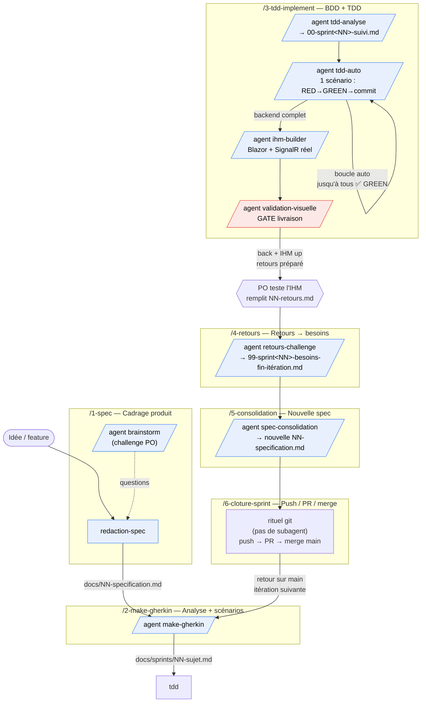

# Workflow Claude — planning-de-garde

Ce dépôt est piloté par un **pipeline d'agents Claude Code** en boucle de sprint.
Chaque étape est une *slash command* (`/N-...`) qui agit en **relais pur** : le thread
principal ne raisonne pas, il dispatche des **subagents** spécialisés, relaie leurs
questions à l'utilisateur via `AskUserQuestion`, et présente les checkpoints. Tout le
raisonnement vit dans les agents — le contexte du main reste propre.

## Principe

- **Spec vivante** : `docs/` à plat est la source de vérité (spec versionnée + `scenarios/`).
- **Boucle de sprint** : la spec engendre des scénarios Gherkin, implémentés en BDD+TDD,
  livrés derrière un **gate visuel impératif**, dont les retours réamorcent une nouvelle
  version de spec.
- **Un sujet par sprint** ; suivi dans `docs/sprints/<sujet>/00-sprint<NN>-suivi.md`
  (`<NN>` = numéro du sprint = préfixe 2 chiffres du dossier, ex. `00-sprint02-suivi.md`).

## Le pipeline en 6 étages

## Détail des étages

| Command | Rôle | Agents | Sortie |
|---------|------|--------|--------|
| `/1-spec` | Cadrage produit (challenge + rédaction) | `brainstorm`, `redaction-spec` | `docs/NN-specification.md` |
| `/2-make-gherkin` | Spec → analyse technique + scénarios Gherkin numérotés | `make-gherkin` | `docs/sprints/NN-sujet.md` |
| `/3-tdd-implement` | Implémentation BDD+TDD, IHM, gate visuel | `tdd-analyse`, `tdd-auto`, `ihm-builder`, `validation-visuelle` | code + tests + dossier `00-sprint<NN>-suivi.md` |
| `/4-retours` | Retours IHM/Tech → besoins priorisés + archivage | `retours-challenge` | `99-sprint<NN>-besoins-fin-itération.md` |
| `/5-consolidation` | Backlog besoins + spec courante → nouvelle spec vivante | `spec-consolidation` | nouvelle `docs/NN-specification.md` |
| `/6-cloture-sprint` | Push, PR vers `main`, merge, retour itération | *(aucun — rituel git)* | branche mergée, retour sur `main` |

## Conventions

- **Relais pur** : le thread principal ne lit ni n'écrit code/spec/scénarios — il délègue.
- **`AskUserQuestion`** : appelé **uniquement** par le thread principal (un subagent ne peut pas).
- **`/3-tdd-implement`** : un scénario Gherkin par run de `tdd-auto` (RED→GREEN→commit),
  puis **enchaînement automatique** du scénario suivant jusqu'à tous `✅ GREEN`
  (sprint mené intégralement, sans blocage entre scénarios).
- **Backend d'abord, IHM en fin** : les scénarios s'arrêtent à la frontière de
  l'Application ; l'IHM Blazor + SignalR réel sont une phase finale (`ihm-builder`).
- **Gate visuel impératif** (`validation-visuelle`) : le sprint ne se conclut qu'après
  la notification « back + IHM up + retours préparé » — le PO teste, remplit le retours,
  puis enchaîne `/4-retours`.
- **Branche** : `ia-{type}/{slug}` ; jamais de commit sur `main` ; jamais de `git add -A`.

## Suivi d'un sprint en cours

- `docs/sprints/<sujet>/00-sprint<NN>-suivi.md` — tableau de bord (compte `X/N` scénarios ;
  `<NN>` = numéro du sprint = préfixe 2 chiffres du dossier, ex. `00-sprint02-suivi.md`).
- `docs/sprints/<sujet>/NN-slug.md` — un fichier par scénario (statuts ⏳/🔴/✅).
- Tags `@rouge`/`@vert` dans le fichier de scénarios source (état du test d'acceptation).
