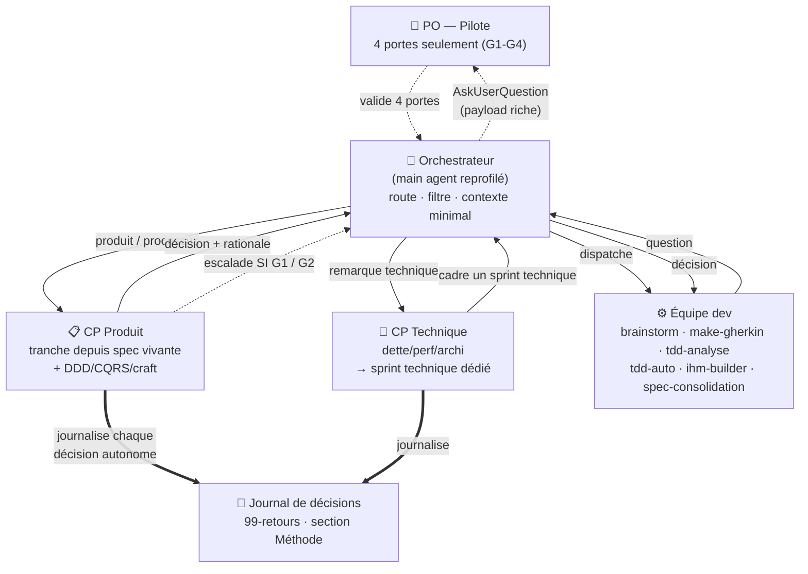
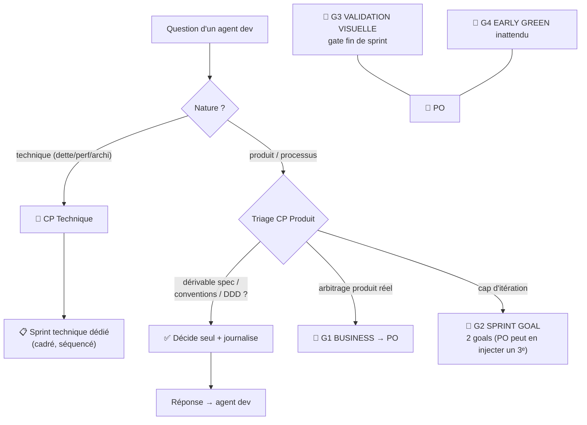
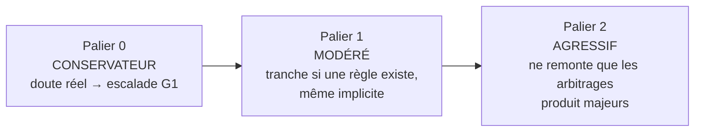
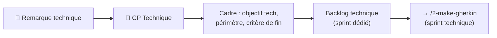
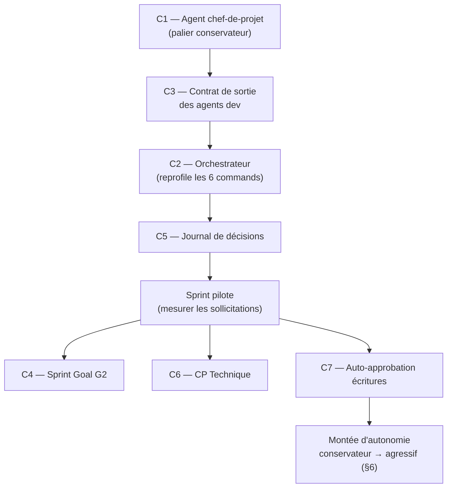

# Plan d'optimisation du pipeline SCRUM — vers une équipe auto-pilotée

> **Statut** : plan d'amélioration (cadrage validé PO, 2026-06-26).
> **Objectif** : inverser le ratio d'autonomie. Aujourd'hui Claude sollicite l'humain à
> chaque ambiguïté ; demain il agit comme une **équipe auto-pilotée** (chefs de projet
> décideurs + équipe de dev craft/BDD/DDD/TDD/CQRS), et ne dérange le PO que sur **4 portes
> essentielles**.

---

## 1. Ce que veut le PO (reformulation)

Le rôle humain doit devenir du **pilotage**, pas de la micro-décision. Concrètement :

- Le **main agent devient un orchestrateur** aussi **peu pollué que possible** : il route, il
  filtre, il ne raisonne pas le métier.
- Une couche **chef de projet décideur** tranche les questions de l'équipe dev à partir de la
  spec vivante, des conventions et des principes (DDD / CQRS / craft).
- Le PO n'est sollicité que sur **4 portes** :
  1. **G1 — Choix métier** (arbitrage produit réel, non dérivable de la spec).
  2. **G2 — Validation du Sprint Goal** : choix proposé **entre 2 goals** (le PO peut en
     injecter un **3ᵉ**, immédiatement adopté).
  3. **G3 — Validation visuelle** + retour sur le travail livré par l'IA.
  4. **G4 — Early Green inattendu** pendant l'implémentation.
- Une **remarque technique** du PO ne se dilue pas dans le flux : elle fait directement l'objet
  d'un **sprint technique dédié**, porté par un **second chef de projet (CP technique)**.
- Quand une question **remonte malgré tout** jusqu'au PO, elle doit arriver avec **assez
  d'information pour trancher** (contexte, options, recommandation du CP, sources, tradeoffs).

---

## 2. Audit — diagnostic central

Le pipeline `/1`→`/6` repose sur **un seul principe** martelé dans chaque command :
**« thread principal = relais pur »**. Le main agent ne raisonne pas et ne tranche rien. Il
dispatche un agent, et **dès qu'un agent rencontre une ambiguïté, elle remonte au PO** via
`AskUserQuestion`.

Conséquence : **l'humain est l'unique décideur**. Il n'existe **aucune couche chef de projet**.

### Sollicitations humaines par command (état actuel)

| Command | Portes humaines aujourd'hui |
|---|---|
| `/1-spec` | boucle challenge (N questions) + validation synthèse + commit |
| `/2-make-gherkin` | gate rétro + boucle challenge + validation + commit |
| `/3-tdd-implement` | validation plan + early-green + routage IHM + problème impl + phase IHM + gate visuel |
| `/4-retours` | bypass Tech + boucle challenge + validation + handoff + commit |
| `/5-consolidation` | boucle consolidation + validation + handoff + commit |
| `/6-cloture-sprint` | rétro + push + PR + merge + amorce |

### Preuves dans le code

- **Chaque agent dev** (`brainstorm`, `tdd-auto`, `spec-consolidation`, `retours-challenge`,
  `make-gherkin`) émet `{type:question}` qui part **toujours et directement au PO**. Aucun n'a
  d'interlocuteur intermédiaire.
- `tdd-auto` escalade au PO même des décisions **mécaniques** : routage backend/IHM, scaffolding,
  early-green *attendu*. (cf. `.claude/agents/tdd-auto.md`, section « Quand poser une question ».)
- Chaque command porte 1 boucle de challenge **multi-questions** + 1 à 3 **gates d'accord**
  (`done:true → présente synthèse → AskUserQuestion accord`). Tous au PO.

**C'est exactement la sur-sollicitation décrite.** Le pipeline est solide (gates rétro
non-contournables, scripts garde-fous, spec vivante versionnée) mais **il lui manque la couche
décisionnelle** entre l'équipe dev et le PO.

---

## 3. Architecture cible — 4 rôles



**Aujourd'hui** : `dev → question → PO`.
**Cible** : `dev → question → chef de projet → décision` ; escalade au PO **seulement** si porte
essentielle.

| Rôle | Qui | Responsabilité |
|---|---|---|
| **Pilote** | PO (humain) | Tranche les 4 portes. Pilote a posteriori via le journal. |
| **Orchestrateur** | main agent | Route les questions, filtre les escalades, garde son contexte propre. Ne raisonne pas le métier. |
| **CP Produit** | nouvel agent | Tranche les questions produit/process depuis la spec + conventions + DDD/CQRS. Escalade en G1/G2 si non tranchable. |
| **CP Technique** | nouvel agent | Capte les remarques techniques du PO, les cadre en **sprint technique dédié**. |
| **Équipe dev** | agents existants | Implémentent en BDD/TDD/DDD. Posent leurs questions au CP, plus au PO. |

---

## 4. Le filtre d'escalade — clé de voûte

Une question n'atteint le PO **que si** elle matche une des 4 portes. Sinon le CP tranche et
journalise.



### Tranché par le CP (plus par le PO)

Routage backend/IHM · scaffolding conventionnel · early-green **attendu** · collisions de
consolidation à résolution déterministe · priorisation **dans** la règle d'arbitrage déjà actée ·
messages de commit · mécanique push/PR sous autorisation préalable · accords d'écriture en fin de
command.

### Réservé au PO — 4 portes

| Porte | Déclencheur | Forme |
|---|---|---|
| **G1 Business** | arbitrage produit non dérivable de la spec | `AskUserQuestion`, payload riche |
| **G2 Sprint Goal** | début de cycle | choix **entre 2 goals** ; le PO peut saisir un **3ᵉ** (option « Other »), **immédiatement adopté** |
| **G3 Visuelle** | fin de sprint, gate de livraison | notification + test manuel + retours |
| **G4 Early Green inattendu** | test censé piloter du code passe sans rouge | `AskUserQuestion` |

---

## 5. Contrat d'escalade — « assez d'info pour décider »

Quand le CP escalade, l'orchestrateur garde **son** contexte minimal, mais **transmet au PO un
payload riche** (le PO doit pouvoir trancher sans relire le code). Structure imposée de l'escalade
émise par le CP :

```json
{
  "escalate": true,
  "gate": "G1",
  "question": { "question": "…?", "header": "≤12 car", "multiSelect": false,
                "options": [ { "label": "… (Recommandé par le CP)", "description": "tradeoff" }, … ] },
  "contexte": "1-3 lignes : d'où vient la question, ce qui est en jeu",
  "recommandation_cp": "ce que le CP ferait et pourquoi",
  "sources": ["docs/06-specification.md §…", "règle …"],
  "consequences": "ce que chaque branche implique en aval"
}
```

L'orchestrateur **relaie ce payload tel quel** dans `AskUserQuestion` (contexte + recommandation
en une ligne au-dessus des options). Principe : **main peu pollué, PO bien informé.**

---

## 6. Le cadran d'autonomie — conservateur → agressif

L'autonomie du CP est un **réglage**, pas un absolu. On démarre **conservateur** et on monte par
paliers, en s'appuyant sur le journal de décisions relu en rétro.



| Palier | Règle du CP en cas de doute | Critère de passage au suivant |
|---|---|---|
| **0 — Conservateur** *(départ)* | doute réel non tranchable par la spec → **escalade G1** | rétro : 0 décision autonome contestée sur 1 sprint |
| **1 — Modéré** | tranche dès qu'une règle existe (même implicite) ; escalade les vrais conflits de valeur | rétro : décisions de palier 1 validées a posteriori |
| **2 — Agressif** | ne remonte que les **arbitrages produit majeurs** | objectif cible |

Le palier courant est une **directive unique** dans l'agent `chef-de-projet` (une ligne à éditer),
pour faire monter l'autonomie sans réécrire le pipeline.

---

## 7. Remarque technique → sprint technique dédié

Une remarque technique du PO (dette, perf, archi, issue de revue) **ne se fond pas** dans le
backlog produit. Elle est captée par le **CP Technique**, qui la cadre **immédiatement** en sujet
de sprint technique séquencé — distinct du flux produit `/4-retours → /5-consolidation`.



Cela remplace le `bypass Tech` ad hoc de `/4-retours` (étape 2) par un **rôle dédié** : la dette
technique a son propre canal et son propre porteur de décision.

---

## 8. Sprint Goal explicite (G2)

Aujourd'hui `brainstorm` extrait l'arbitre en **boucle ouverte** (N questions au PO). Cible :

- `brainstorm` (et `spec-consolidation` en début de cycle) produit **2 sprint goals candidats
  cadrés** (intitulé + valeur + périmètre).
- L'orchestrateur surface **une seule** question G2 : choix entre les 2.
- Le PO peut **saisir un 3ᵉ goal** (option libre `AskUserQuestion`) ; s'il le fait, sa décision
  est **immédiatement suivie** — pas de re-challenge, le CP cadre le sprint sur ce 3ᵉ goal.

Une question au lieu d'une boucle. Le PO garde la main totale sur le cap.

---

## 9. Plan — chantiers, fichiers touchés, tradeoffs

### C1 — Agent `chef-de-projet` (CP Produit) — le cœur
- **Créer** `.claude/agents/chef-de-projet.md` + `.claude/skills/chef-de-projet/SKILL.md`.
- **Entrée** : question d'un agent dev + chemins spec/conventions + palier d'autonomie courant.
- **Sortie** : `{decision, rationale, sources}` **ou** le contrat d'escalade §5 (`gate:G1|G2`).
- **Tradeoff** : risque de décision « trop autonome » → mitigé par C5 (journalisation) + palier
  conservateur au départ (§6).

### C2 — Reprofiler le main agent en orchestrateur
- **Éditer** l'en-tête « relais pur » des 6 commands (`.claude/commands/1-spec.md` →
  `6-cloture-sprint.md`) en **« orchestrateur »** : route les questions dev vers le CP, n'appelle
  `AskUserQuestion` **que** pour un `escalate` G1/G2 ou les gates G3/G4.
- **Tradeoff** : spéc des commands plus longue à écrire une fois, beaucoup moins d'A/R ensuite.

### C3 — Contrat de sortie des agents dev
- **Éditer** `tdd-auto`, `make-gherkin`, `spec-consolidation`, `retours-challenge`, `tdd-analyse`,
  `brainstorm` : `{type:question}` → `{type:question, audience:"chef-de-projet"|"human", gate?}`.
- Ex. `tdd-auto` : early-green *attendu*, routage IHM, scaffolding → `audience:"chef-de-projet"` ;
  early-green *inattendu* → `gate:"G4"` (reste humain).
- **Tradeoff** : touche 6 fichiers d'agents, mais c'est le branchement qui rend l'autonomie réelle.

### C4 — Sprint Goal explicite (G2)
- **Éditer** `brainstorm.md` + skill `brainstorm` : produire **2 goals candidats** au lieu d'une
  boucle ouverte ; supporter l'injection d'un **3ᵉ** immédiatement adopté.
- Idem `spec-consolidation` en amorce de cycle.

### C5 — Journal de décisions autonomes
- **Convention** : le CP écrit chaque décision tranchée seul dans `# Méthode (agents)` du
  `99-sprint<NN>-retours.md` (fichier existant). Le PO pilote **a posteriori** en rétro.
- **Tradeoff** : léger surcoût d'écriture ; c'est ce qui rend l'autonomie **sûre et révisable**.

### C6 — CP Technique + canal sprint technique
- **Créer** `.claude/agents/chef-de-projet-technique.md` (+ skill).
- **Éditer** `/4-retours` (étape 2 « bypass Tech ») : router les remarques techniques vers le CP
  Technique qui cadre un **sprint technique dédié** (§7), au lieu d'un bypass inline.

### C7 — Auto-approbation des écritures
- **Éditer** `/1`, `/2`, `/4`, `/5` : les gates « présente synthèse → AskUserQuestion accord »
  deviennent décision du CP, **sauf** si la synthèse contient un G1 non résolu. Idem messages de
  commit (déjà sous convention).

### Inchangé (déjà bon, ne pas toucher)
Gates rétro non-contournables (`find-retro.ps1`) · scripts PowerShell garde-fous (git, archivage,
propagation) · format spec vivante versionnée · gate visuel G3 (`validation-visuelle`) · structure
du dossier de sprint · boucle 6 étages.

---

## 10. Séquencement de mise en œuvre



**Ordre conseillé** : C1 → C3 → C2 → C5 d'abord (le squelette décisionnel + sa traçabilité), puis
**un sprint pilote** pour mesurer la baisse de sollicitations, puis C4/C6/C7, puis montée de palier
d'autonomie. On valide chaque palier en rétro avant le suivant.

### Indicateur de succès
Nombre de `AskUserQuestion` par sprint **avant / après**, ventilé G1/G2/G3/G4 vs autres. Cible :
**toute sollicitation hors G1-G4 = 0**.
